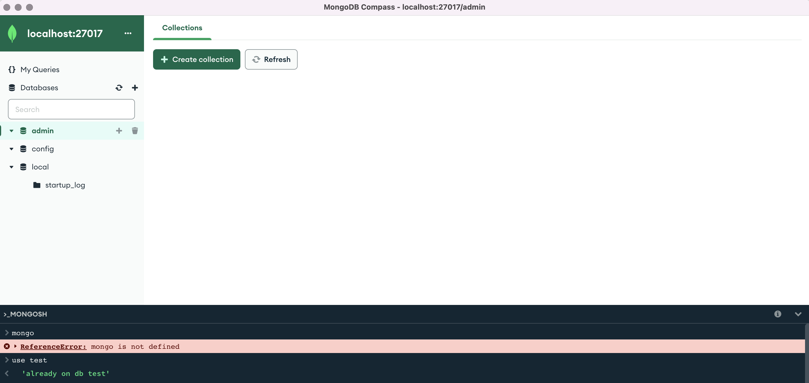

# Sesión 6 : Introducción a MongoDB

Tabla de contenido:

- [Usando MongoDB](#usando-mongo)
  * [Documentos en lugar de filas/columnas](#documentos-en-lugar-de-filas-columnas)
    + [Tipos de datos](#tipos-de-datos)
- [Comenzando con MongoDB](#comenzando-con-mongodb)
  * [Conectando a mongodb:](#conectando-a-mongodb-)
  * [Selección/creación/eliminación de la base de datos](#selecci-n-creaci-n-eliminaci-n-de-la-base-de-datos)
  * [Crear una colección](#crear-una-colecci-n)
  * [Borrar las colecciones](#borrar-las-colecciones)
  * [Trabajar con documentos sobre las colecciones](#trabajar-con-documentos-sobre-las-colecciones)
  * [Seleccionando, Consultando y Filtrando](#seleccionando--consultando-y-filtrando)
  * [Actualizando documentos](#actualizando-documentos)
  * [Borrando documentos](#borrando-documentos)
  * [Importar datos externos](#importar-datos-externos)
  * [Clients MongoDB](#clients-mongodb)
- [References](#references)

# Usando MongoDB

MongoDB es una base de datos de código abierto desarrollada por MongoDB, Inc. Se trata de una BD No-SQL orientada al desarrollo en la nube. 

MongoDB almacena datos en documentos similares a JSON que pueden variar en estructura. La información relacionada se almacena junta para un acceso rápido a la consulta a través del lenguaje de consulta MongoDB. MongoDB utiliza esquemas dinámicos, lo que significa que puede crear registros **sin definir primero la estructura**, como los campos o los tipos de sus valores. Puede cambiar la estructura de los registros (a los que llamamos documentos) simplemente añadiendo nuevos campos o borrando los existentes. Este modelo de datos permite representar relaciones jerárquicas, almacenar matrices y otras estructuras más complejas fácilmente. No es necesario que los documentos de una colección tengan un conjunto idéntico de campos y es frecuente la desnormalización de los datos. MongoDB también fue diseñado con alta disponibilidad y escalabilidad en mente, e incluye replicación lista para usar y auto-sharding.


**MongoDB principales características:**

* Almacenamiento orientado a documentos - Los datos se almacenan en forma de documentos de estilo JSON.
* Índice sobre cualquier atributo
* Replicación y alta disponibilidad
* Auto-sharding
* Consultas ricas

**Usando Mongo:**

* Big Data
* Gestión y entrega de contenidos
* Infraestructura Móvil y Social
* Gestión de datos de usuario
* Hub de datos

**Comparado con MySQL:**

Muchos conceptos en MySQL tienen análogos cercanos en MongoDB. Algunos de los conceptos comunes en cada sistema:

* MySQL -> MongoDB
* Database -> Database
* Table -> Collection
* Row -> Document
* Column -> Field
* Joins -> Embedded documents, linking

**Lenguaje de consulta:**

Desde MySQL:

```
INSERT INTO users (user_id, age, status)
VALUES ('bcd001', 45, 'A');
```

A MongoDB:

```
db.users.insert({
  user_id: 'bcd001',
  age: 45,
  status: 'A'
});
```

Desde MySQL:

```
SELECT * FROM users
```

A MongoDB:

```
db.users.find()
```


Desde MySQL:

```
UPDATE users SET status = 'C'
WHERE age > 25
```

A MongoDB:

```
db.users.update(
  { age: { $gt: 25 } },
  { $set: { status: 'C' } },
  { multi: true }
)
```


## Documentos en lugar de filas/columnas

MongoDB almacena registros de datos como documentos BSON. 

BSON es una representación binaria de documentos JSON, contiene más tipos de datos que JSON.

)

Los documentos MongoDB se componen de pares de campo y valor y tienen la siguiente estructura:


```
{
   field1: value1,
   field2: value2,
   field3: value3,
   ...
   fieldN: valueN
}
```

Ejemplo de documento:

```
var mydoc = {
               _id: ObjectId("5099803df3f4948bd2f98391"),
               name: 
               		{ 
               		 first: "Alan", 
               		 last: "Turing" 
               		},
               birth: new Date('Jun 23, 1912'),
               death: new Date('Jun 07, 1954'),
               contribs: [ 
               				"Turing machine", 
               				"Turing test", 
               				"Turingery" ],
               views : NumberLong(1250000)
            }
```

Para especificar o acceder a un campo de un documento: utilice la notación por puntos

```
mydoc.name.first
```

Los documentos permiten documentos incrustados documentos incrustados documentos incrustados ....:

```
{
   ...
   name: { first: "Alan", last: "Turing" },
   contact: { 
   			phone: { 
   					model: { 
   						brand: "LG", 
   						screen: {'maxres': "1200x800"} 
   					},
   					type: "cell", 
   					number: "111-222-3333" } },
   ...
}
```


### Tipos de datos

* String − This is the most commonly used datatype to store the data.
* Integer − This type is used to store a numerical value.
* Boolean − This type is used to store a boolean (true/ false) value.
* Double − This type is used to store floating point values.
* Min/ Max keys − This type is used to compare a value against the lowest and highest BSON elements.
* Arrays − This type is used to store arrays or list or multiple values into one key.
* Timestamp − ctimestamp. This can be handy for recording when a document has been modified or added.
* Object − This datatype is used for embedded documents.
* Null − This type is used to store a Null value.
* Symbol − This datatype is used identically to a string; however, it's generally reserved for languages that use a specific symbol type.
* Date − This datatype is used to store the current date or time in UNIX time format. You can specify your own date time by creating object of Date and passing day, month, year into it.
* Object ID − This datatype is used to store the document’s ID.
* Binary data − This datatype is used to store binary data.
* Code − This datatype is used to store JavaScript code into the document.
* Regular expression − This datatype is used to store regular expression.


# Comenzando con MongoDB

Vamos a desplegar en local un servicio de MongoDB utilizando Docker o Docker Compose siguiendo las instrucciones de la web: https://www.mongodb.com/compatibility/docker. 
Para ello, en primer lugar desplegamos un servidor MongoDB en local y exponemos el puerto 27017 (puerto por defecto para MongoDB) por si queremos conectar MongoDB con otra aplicación en local: 

```
docker run --name mongodb -d -p 27017:27017 mongodb/mongodb-community-server
```

Sin embargo, los datos que creemos serán volátiles y se eliminarán una vez que echemos abajo el contenedor. Para evitarlo, hacemos los datos persistentes en un volumen de datos con la opción ```--v```. Para desplegar el contenedor con esta opción, primero retiramos el contenedor anterior:
```
docker stop mongodb && docker rm mongodb
```
Y a continuación lo levantamos de nuevo: 
```
docker run --name mongodb -d -p 27017:27017 -v $(pwd)/data:/data/db mongodb/mongodb-community-server
```

Podemos conectarnos a este servicio utilizando la [shell MongoSH](https://www.mongodb.com/try/download/shell) o el [cliente Compass con GUI](https://www.mongodb.com/try/download/compass). Prueba a instalar el cliente Compass y familiarízate con la interfaz de usuario. El cliente Compass incluye, además de la interfaz gráfica, el cliente MongoSH para interactuar con MongoDB a través de una shell. 



A continuación se indica cómo crear, manipular y consultar registros de datos como documentos y colecciones MongoDB en la shell MongoSH. Puedes irlos ejecutando desde Compass e ir visualizando los cambios desde la interfaz gráfica. El [manual de MongoDB](https://www.mongodb.com/docs/manual/) debe ser tu referencia principal en todo el proceso. 

## Selección/creación/eliminación de la base de datos

El comando creará una nueva base de datos si no existe, de lo contrario devolverá la base de datos existente.

```
> use test
```

Ahora estás usando la base de datos ``test`` .

Si quieres saber qué base de datos estás usando:

```
> db
```

El comando ``command db.dropDatabase()`` es usado para borrar la base de datos existente. Cuidado con su uso: 

```
db.dropDatabase()
```

Para conocer el tamaño de las bases de datos:

```
show databases
```

## Crear una colección

La sintaxis básica del comando createCollection() es la siguiente:

```
db.createCollection(name, options)
```

donde ``options`` es Opcional y especifica opciones sobre el tamaño de la memoria y la indexación.

Recuerde que en primer lugar el mongodb necesita saber cuál es la Base de Datos donde creará la Colección. Use ``show dbs`` y luego ``use <su base de datos>``.

```
use test
```

Y luego creamos la colección:

```
db.createCollection("MyFirstCollection")
```

Ahora comprobamos que está disponible:

```
show collections
```

En MongoDB, no es necesario crear la colección. MongoDB crea la colección automáticamente, cuando usted inserta algún documento:

```
db.MySecondCollection.insertOne({"name" : "Carlos Cano"})
```

Ya tienes las nuevas colecciones creadas:

```
show collections
```

## Borrar las colecciones

Para borrar las colecciones desde la base de datos:

```
db.MySecondCollection.drop();

```


## Trabajar con documentos sobre las colecciones

Para insertar datos en la colección de MongoDB, necesita usar el método ``insert()`` o ``save()`` de MongoDB.

```
> db.MyFirstCollection.insert(<document>);
```

Ejemplo de documento: place 

```
{    
     "bounding_box":
    {
        "coordinates":
        [[
                [-77.119759,38.791645],
                [-76.909393,38.791645],
                [-76.909393,38.995548],
                [-77.119759,38.995548]
        ]],
        "type":"Polygon"
    },
     "country":"United States",
     "country_code":"US",
     "likes":2392842343,
     "full_name":"Washington, DC",
     "id":"01fbe706f872cb32",
     "name":"Washington",
     "place_type":"city",
     "url": "http://api.twitter.com/1/geo/id/01fbe706f872cb32.json"
}
```

Para insertar:

```
db.MyFirstCollection.insert(
{    
     "bounding_box":
      {
        "coordinates":
        [[
                [-77.119759,38.791645],
                [-76.909393,38.791645],
                [-76.909393,38.995548],
                [-77.119759,38.995548]
        ]],
        "type":"Polygon"
      },
     "country":"United States",
     "country_code":"US",
     "likes":2392842343,
     "full_name":"Washington, DC",
     "id":"01fbe706f872cb32",
     "name":"Washington",
     "place_type":"city",
     "url": "http://api.twitter.com/1/geo/id/01fbe706f872cb32.json"
}
);
```

Comprobar si el documento está almacenado:

```
> db.MyFirstCollection.find();
```

Añade multiple documentos:

```
	var places= [
		{    
	     "bounding_box":
	      {
	        "coordinates":
	        [[
	                [-77.119759,38.791645],
	                [-76.909393,38.791645],
	                [-76.909393,38.995548],
	                [-77.119759,38.995548]
	        ]],
	        "type":"Polygon"
	      },
	     "country":"United States",
	     "country_code":"US",
	     "likes":2392842343,
	     "full_name":"Washington, DC",
	     "id":"01fbe706f872cb32",
	     "name":"Washington",
	     "place_type":"city",
	     "url": "http://api.twitter.com/1/geo/id/01fbe706f872cb32.json"
	},
	{    
	     "bounding_box":
	      {
	        "coordinates":
	        [[
	                [-7.119759,33.791645],
	                [-7.909393,34.791645],
	                [-7.909393,32.995548],
	                [-7.119759,34.995548]
	        ]],
	        "type":"Polygon"
	      },
	     "country":"Spain",
	     "country_code":"ES",
	     "likes":2334244,
	     "full_name":"Madrid",
	     "id":"01fbe706f872cb32",
	     "name":"Madrid",
	     "place_type":"city",
	     "url": "http://api.twitter.com/1/geo/id/01fbe706f87333e.json"
	}
	]
```

y:

```
db.MyFirstCollection.insert(places)
```

En el documento insertado, si no especificamos el parámetro ``_id``, entonces MongoDB asigna un ObjectId único para este documento.

## Seleccionando, Consultando y Filtrando

Muestra todos los documentos en ``MyFirstCollection``:

```
> db.MyFirstCollection.find();
```

Sólo un documento:

```
> db.MyFirstCollection.findOne();
```

Cuenta los documentos, añade  ``.count()`` al comando:

```
> db.MyFirstCollection.find().count();
```

Selecciona o busca mediante campos, por ejemplo como ``bounding_box.type``:

```
...
 "bounding_box":
    {
        "coordinates":
        [[
                [-77.119759,38.791645],
                [-76.909393,38.791645],
                [-76.909393,38.995548],
                [-77.119759,38.995548]
        ]],
        "type":"Polygon"
    },
...
```


```
> db.MyFirstCollection.find({"bounding_box.type": "Polygon"})
```


Filtrado:

Igualdad	``{<key>:<value>}``	 ``db.MyFirstCollection.find({"country":"Spain"})``

Menor que 	``{<key>:{$lt:<value>}}``	``db.MyFirstCollection.find({"likes":{$lt:3000000}})``

Menor o igual	``{<key>:{$lte:<value>}}``	``db.MyFirstCollection.find({"likes":{$lte:3000000}})``

Mayor que	``{<key>:{$gt:<value>}}``	``db.MyFirstCollection.find({"likes":{$gt:3000000}})``

Más o igual que : ``gte`` Greater than equal, ``ne`` Not equal, etc. 

Y:

```
> db.MyFirstCollection.find(
   {
      $and: [
         {key1: value1}, {key2:value2}
      ]
   }
)
```

O:
> db.MyFirstCollection.find(
   {
      $or: [
         {key1: value1}, {key2:value2}
      ]
   }
)

Mezclando todo:

```
db.MyFirstCollection.find(
		{"likes": {$gt:1000000}, 
		 $and: 
			[
			 {"country_code":"ES"},
   			 {"place_type":"city"}
   			]
   		})
```


Usando expresiones regulares en los campos, por ejemplo para buscar documentos donde el nombre  ``name`` contenga ``Wash``.


```
db.MyFirstCollection.find({"name": /.*Wash.*/})

```


## Actualizando documentos

Sintaxis:

```
> db.MyFirstCollection.update(<selection criteria>, <data to update>)
```

Ejemplo:

```
db.MyFirstCollection.updateMany(
  	 { 'place_type':'city'},
	 { $set: {'principal':'Yes'}},
	 {multi:true}
	);
```

IMPORTANTE: use ``multi:true`` para actualizar todas las coincidencias.


## Borrando documentos

MongoSH tiene el método  ``deteteOne()`` y ``deleteMany()`` para borrar un(os) documento(s) de una colección. 

Ejemplo:

```
db.MyFirstCollection.deleteMany({'country':'United States'})
```


## Importar datos externos

Descarga este conjunto de datos (http://samplecsvs.s3.amazonaws.com/SacramentocrimeJanuary2006.csv)

[DataSet](http://samplecsvs.s3.amazonaws.com/SacramentocrimeJanuary2006.csv) (7585 rows and 794 KB)

Usando el comando siguiente:

```
curl -O http://samplecsvs.s3.amazonaws.com/SacramentocrimeJanuary2006.csv
```

o desde [github](./datasetmongodb/SacramentocrimeJanuary2006.csv).

Importa el fichero a MongoDB de esta forma: 

```
mongoimport -d <your user> -c <your collection> --type csv --file /tmp/SacramentocrimeJanuary2006.csv --headerline
```

Prueba las siguientes consultas a la colección:

- Cuenta el número de delitos/robos.
- Cuenta el número de delitos por hora.


## Clients MongoDB

- Command line tools: https://github.com/mongodb/mongo-tools
- Use Mongo from PHP: https://github.com/mongodb/mongo-php-library
- Use Mongo from NodeJS: https://mongodb.github.io/node-mongodb-native/
- Perl to MongoDB: https://docs.mongodb.com/ecosystem/drivers/perl/
- Full list of Mongo Clients (all languages): https://docs.mongodb.com/ecosystem/drivers/#drivers


# References 
- Manual MongoDB: https://www.mongodb.com/docs/manual/
- Getting Started with MongoDB (MongoDB Shell Edition): https://docs.mongodb.com/getting-started/shell/
- MongoDB Tutorial: https://www.tutorialspoint.com/mongodb/
- MongoDB Tutorial for Beginners: https://www.youtube.com/watch?v=W-WihPoEbR4
- Mongo Shell Quick Reference: https://docs.mongodb.com/v3.2/reference/mongo-shell/
