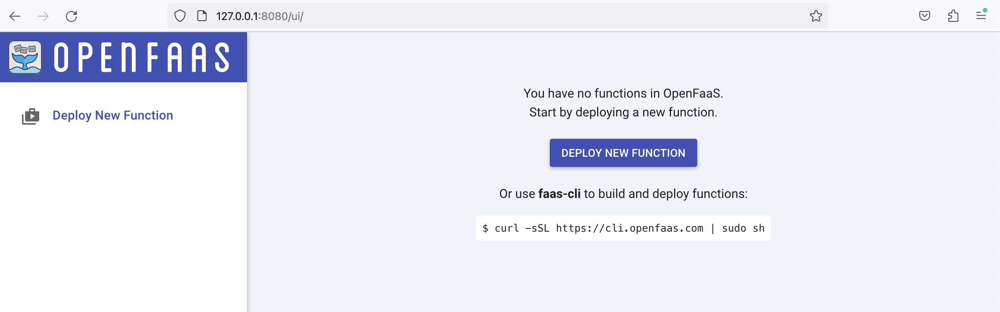
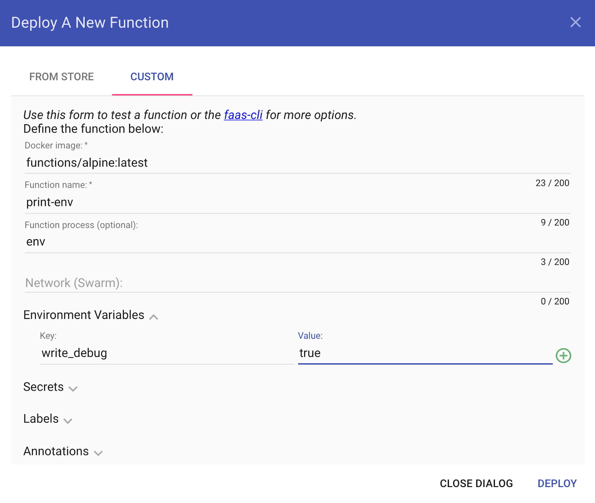

# Introduction to Function as a Service


## Introduction to Function as a Service (FaaS)

Before we dive into Function as a Service (FaaS), let's see what the journey has been before FaaS: 
Physical Servers > Virtual Machines > Containers > Functions. 

Earlier, Physical Servers were used to run applications. Though they offered good performance, they were meant to support the working of specific applications only. If another application were to run on them, it would affect the workflows of both. The rise of Virtual Machines in 2001 allows enabling application-specific resources from physical machines to VM instances. This decreased the infrastructure concerns related to particular applications on physical servers. Then Docker containers came, which provided a lightweight alternative to Virtual machines by encapsulating only the application and it is specific dependencies inside a container. 

Functions make the developer's process even more autonomous. 
Functions are code snippets inside the container. 
Execute them based on some events. 

For example, a function can be made which creates a database, and on creation, it populates that database with values. Without functions, developers would have to wait for database creation and then manually update the database.

## What is Function as a Service (FaaS)?

Function as a Service is a cloud service execution model and uses functions for the purpose. As stated above, Function is a piece of code of business logic, more particularly, which is event-driven. That means that it gets triggered and performs its part on a launch of a particular event until the task is done. Functions can be of various types such as :

- Function to process a web request
- Function for any scheduled job
- A function that executes manually.

Moreover, we can also chain functions, which means a particular function on completion can trigger another function to execute. For example, a function for web requests on completion can trigger any scheduled job function. This way, the process becomes more autonomous.

Summing up, FaaS is a serverless way to execute modular pieces of code. FaaS lets developers write and update a piece of code on the fly, which can then be executed in response to an event, such as a user clicking on an element in a web application. This makes it easy to scale code and is a cost-efficient way to implement microservices.

### What are the advantages of using FaaS?

*Improved developer velocity*: With FaaS, developers can spend more time writing application logic and less time worrying about servers and deployment. This typically means a much faster development turnaround.

*Built-in scalability*: Since FaaS code is inherently scalable, developers do not have to worry about contingencies due to high traffic or heavy use. The serverless provider will handle all of the scaling concerns.

*Cost efficiency*: Unlike traditional cloud providers, serverless FaaS providers do not charge their clients for idle computation time. Because of this, clients only pay for as much computation time as they use, and do not need to waste money over-provisioning cloud resources.


### What are the drawbacks of FaaS?

*Less system control*: Having a third party managing part of the infrastructure makes it tough to understand the whole system and adds debugging challenges.

*More complexity required for testing*: It can be very difficult to incorporate FaaS code into a local testing environment, making thorough testing of an application a more intensive task.

### List of Function as a Service (FaaS) Service providers on Public Clouds

- Microsoft Azure
- Amazon Web Services (AWS)
- Cloud Functions
- IBM functions
- Algoritmia
- ...

### Example
Below is a sample example of an Azure function snippet. 

```
Using System.Net; 
public static async Task<HttpResponseMessage> Run(HttpRequestMessage req, TraceWriter log) {     
  log.Info("C# HTTP trigger function processed a request.");     
  // Get request body     
  dynamic data = await req.Content.ReadAsAsync<object>();     
  return req.CreateResponse(HttpStatusCode.OK, "Hello " + data.name);
 }
 ```
 

## How does Function as a Service Work?
Anyone who wants to get the benefits of FaaS needs to use a cloud service provider to implement FaaS.

- In the FaaS model, developers are not concerned with infrastructure and service-related computing, and they are only concerned with writing functions.
- These functions on getting invoked will cause the cloud provider to bring up the server, and on the successful execution of the Function, the server goes down.
- These servers get available on demand when the Function invokes and goes down until the Function executes. Thus saving cost for the subscriber of cloud services as well.


## What is the Serverless Architecture of FaaS?

Serverless architecture is a far broader concept than FaaS. Serverless computing offers a number of advantages over traditional cloud-based or server-centric infrastructure. For many developers, serverless architectures offer greater scalability, more flexibility, and quicker time to release, all at a reduced cost. With serverless architectures, developers do not need to worry about purchasing, provisioning, and managing backend servers. However, serverless computing is not a magic bullet for all web application developers.


Serverless computing allows developers to purchase backend services on a flexible ‘pay-as-you-go’ basis, meaning that developers only have to pay for the services they use. This is like switching from a cell phone data plan with a monthly fixed limit, to one that only charges for each byte of data that actually gets used.

The term ‘serverless’ is somewhat misleading, as there are still servers providing these backend services, but all of the server space and infrastructure concerns are handled by the vendor. Serverless means that the developers can do their work without having to worry about servers at all.

### Is Serverless for you?

Developers who want to decrease their go-to-market time and build lightweight, flexible applications that can be expanded or updated quickly may benefit greatly from serverless computing.

Serverless architectures will reduce the cost for applications that see inconsistent usage, with peak periods alternating with times of little to no traffic. For such applications, purchasing a server or a block of servers that are constantly running and always available, even when unused, may be a waste of resources. A serverless setup will respond instantly when needed and will not incur costs when at rest.

Also, developers who want to push some or all of their application functions close to end users for reduced latency will require at least a partially serverless architecture, since doing so necessitates moving some processes out of the origin server.

### Example of services provided by the vendor in a Serverless Architecture
 With a large number of workloads now shifting to the cloud, cloud providers need to provide backend services like:

- Load balancer configuration
- Cluster management
- Operating system to support the workloads, etc

These are known as BaaS (Backend as a service). And serverless architecture comprises FaaS and BaaS. For example, in databases, many BaaS solution providers provide data validation mechanisms so an application can use these at its backend to authenticate with the database. Now FaaS comes into play. Consider the case when a new record is inserted into the database. Using FaaS, a small function can be added inside the application container, triggered when a new record is added inside the database. The serverless architecture makes FaaS more reliable and affordable. It promotes the trend to implement things as services and use API gateways to map HTTP requests with those functions.

## Platforms

### OpenFaaS

OpenFaaS&reg; makes it easy for developers to deploy event-driven functions and microservices to Kubernetes without repetitive, boiler-plate coding. Package your code or an existing binary in an OCI-compatible image to get a highly scalable endpoint with auto-scaling and metrics.


**Highlights**

* Ease of use through UI portal and *one-click* install
* Write services and functions in any language with [Template Store](https://www.openfaas.com/blog/template-store/) or a Dockerfile
* Build and ship your code in an OCI-compatible/Docker image
* Portable: runs on existing hardware or public/private cloud by leveraging [Kubernetes](https://github.com/openfaas/faas-netes)
* [CLI](http://github.com/openfaas/faas-cli) available with YAML format for templating and defining functions
* Auto-scales as demand increases [including to zero](https://docs.openfaas.com/architecture/autoscaling/)
* [Commercially supported distribution by the team behind OpenFaaS](https://openfaas.com/support/)

**Want to dig deeper into OpenFaaS?**

* Trigger endpoints with either [HTTP or events sources such as Apache Kafka and AWS SQS](https://docs.openfaas.com/reference/triggers/)
* Offload tasks to the built-in [queuing and background processing](https://docs.openfaas.com/reference/async/)
* Quick-start your Kubernetes journey with [GitOps from OpenFaaS Cloud](https://docs.openfaas.com/openfaas-cloud/intro/)
* Go secure or go home [with 5 must-know security tips](https://www.openfaas.com/blog/five-security-tips/)
* Learn everything you need to know to [go to production](https://docs.openfaas.com/architecture/production/)
* Integrate with Istio or Linkerd with [Featured Tutorials](https://docs.openfaas.com/tutorials/featured/#service-mesh)
* Deploy to [Kubernetes or OpenShift](https://docs.openfaas.com/deployment/)

## Overview of OpenFaaS (Serverless Functions Made Simple)

Conceptual architecture and stack, [more detail available in the docs](https://docs.openfaas.com/architecture/stack/)

This is the so-called PLONK Stack: 
- Prometheus
- Linux
- OpenFaaS
- NATS
- Kubernetes
- it also requires a Container Runtime and Conainer Registry such as Docker (but there is no letter in the name for this ;)

The following diagram represent the conceptual architecture for OpenFaaS: 


The core functionality provided by the OpenFaaS Gateway is to:

- Create, list, update and delete functions.
- Scale function replicas.
- Invoke a function.
- Query the health, metrics, and scaling status of functions. 
- Create, list and delete secrets.
- View the logs from functions.
- Queue-up asynchronous requests.

The three ways of interacting with the REST API tend to be:

- Using the CLI (`faas-cli`).
- Using the built-in UI.
- Or via the REST API directly from your application or via cURL.

All communication within OpenFaaS happens over HTTP using REST. This simple interface is made powerful when coupled with events and triggers.


### OpenFaaS and Kubernetes

Our bare essentials for Serverless on Kubernetes are:

- A container image with function code or an executable inside.
- A registry to host the container image.
- A Pod to run the container image.
- A Service to access the Pod.

Often, projects will add many more components on top of this stack, such as a UI, and API gateway, auto-scaling, APIs, and many more.


## OpenFaaS Installation instructions

For installing OpenFaaS on top of a Kubernetes installation, we will proceed as follows: 

- Install minikube (See [session 4](https://github.com/ccano/cc2223/tree/main/session4)).
- Install [arkade](https://github.com/alexellis/arkade). 
- Install OpenFaaS on Kubernetes using arkade.

You might choose a different installation pipeline for your system. Check the OpenFaas website for installation manuals and instructions. 

### Installation of Arkade and OpenFaas

Arkade is an App installer for Kubernetes. It relies on Helm3 and Kubernetes, and eases and speeds up the installation of over 50 apps. 
We will use arkade to install OpenFaaS. 

First, we will install arkade (you can find more installation instructions [here](https://github.com/alexellis/arkade))
```
curl -sLS https://get.arkade.dev |sudo sh
```

Then, we install openfaas using arkade: 
```
arkade install openfaas
````

After the installation has completed, you will receive the commands you need to run, to log in and access the OpenFaaS Gateway service in Kubernetes.

```
Info for app: openfaas 
# Get the faas-cli 
curl -SLsf https://cli.openfaas.com | sudo sh

# Forward the gateway to your machine 
kubectl rollout status -n openfaas deploy/gateway 
kubectl port-forward -n openfaas svc/gateway 8080:8080 &

# If basic auth is enabled, you can now log into your gateway: 
PASSWORD=$(kubectl get secret -n openfaas basic-auth -o 
jsonpath="{.data.basic-auth-password}" | base64 --decode; echo) 
echo -n $PASSWORD | faas-cli login --username admin --password-stdin

faas-cli store deploy figlet 
faas-cli list
```

You can get this message again at any time with ``arkade info openfaas``.

The `kubectl rollout status` command checks that all the containers in the core OpenFaaS stack have started and are healthy.

The `kubectl port-forward` command securely forwards a connection to the OpenFaaS Gateway service within your cluster to your laptop on port 8080. It will remain open for as long as the process is running, so if it appears to be inaccessible later on, just run this command again.

The `faas-cli login` command and preceding line populate the PASSWORD environment variable. You can use this to get the password to open the UI at any time.

We then have faas-cli store deploy figlet and faas-cli list. The first command deploys an ASCII generator function from the Function Store and the second command lists the deployed functions, you should see figlet listed.

You will also find the PLONK stack components deployed, such as Prometheus and NATS. You can see them in the openfaas Kubernetes namespace:

```
kubectl get deploy --namespace openfaas

NAME           READY   UP-TO-DATE   AVAILABLE   AGE
alertmanager   1/1     1            1           1m
gateway        1/1     1            1           1m
nats           1/1     1            1           1m
prometheus     1/1     1            1           1m
queue-worker   1/1     1            1           1m
```

Run again ``arkade info openfaas`` and run the specified commands: 
```
# Get the faas-cli
curl -SLsf https://cli.openfaas.com | sudo sh

# Forward the gateway to your machine
kubectl rollout status -n openfaas deploy/gateway
kubectl port-forward -n openfaas svc/gateway 8080:8080 &

# If basic auth is enabled, you can now log into your gateway:
PASSWORD=$(kubectl get secret -n openfaas basic-auth -o jsonpath="{.data.basic-auth-password}" | base64 --decode; echo)
echo -n $PASSWORD | faas-cli login --username admin --password-stdin

echo $PASSWORD
```
**This last command will set up and print the admin password for login into the OpenFaaS gateway. Copy this password to use it to log into the UI. **

Now you can open a browser to ``http://127.0.0.1:8080/ui/`` and log in using username ``admin`` and the password you just copied. 




## Your first OpenFaaS function

With OpenFaaS you can define functions either via a CLI or via the UI of the OpenFaaS gateway. For creating a new FaaS, you can click on the *Deploy New Function* button on the menu in the left for the UI. Go to the *Custom* tab and copy the data from the screenshot below



Click *deploy*. 


### Code samples

You can generate new functions using the `faas-cli` and built-in templates or use any binary for Windows or Linux in a container.

Official templates exist for many popular languages and are easily extensible with Dockerfiles.

* Node.js (`node12`) example:

    ```js
   "use strict"

    module.exports = async (event, context) => {
        return context
            .status(200)
            .headers({"Content-Type": "text/html"})
            .succeed(`
            <h1>
                👋 Hello World 🌍
            </h1>`);
    }

    ```
    *handler.js*

* Python 3 example:

    ```python
    import requests

    def handle(req):
        r =  requests.get(req, timeout = 1)
        return "{} => {:d}".format(req, r.status_code)
    ```
    *handler.py*

* Golang example (`golang-http`)

    ```golang
    package function

    import (
        "log"

        "github.com/openfaas-incubator/go-function-sdk"
    )

    func Handle(req handler.Request) (handler.Response, error) {
        var err error

        return handler.Response{
            Body: []byte("Try us out today!"),
            Header: map[string][]string{
                "X-Served-By": []string{"openfaas.com"},
            },
        }, err
    }
    ```


# References

- EdX Course by the Linux Foundation: Serverless, FaaS with OpenFaaS and Kubernetes: (https://learning.edx.org/course/course-v1:LinuxFoundationX+LFS157x+1T2022)


