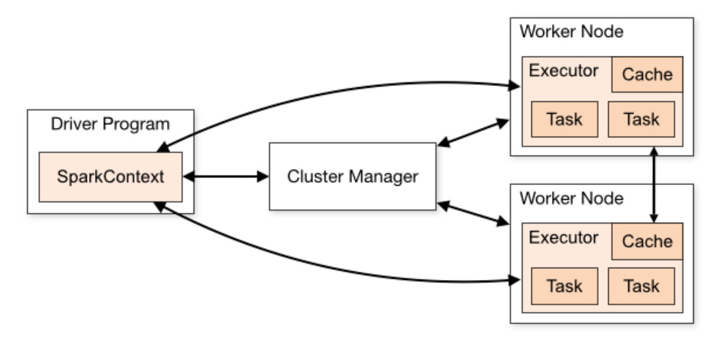

# HDFS, Hadoop and Spark

Original texts by Manuel Parra: manuelparra@decsai.ugr.es and José Manuel Benítez: j.m.benitez@decsai.ugr.es

With contributions by Carlos Cano: carloscano@ugr.es

Content:

- [HDFS, Hadoop](#workshop-material-for-hdfs--hadoop-and-spark)
  * [How to connect](#how-to-connect)
  * [What is hadoop.ugr.es](#what-is-hadoopugres)
  * [Working with HDFS](#working-with-hdfs)
    + [HDFS basics](#hdfs-basics)
    + [HDFS storage space](#hdfs-storage-space)
    + [Usage HDFS](#usage-hdfs)
  * [Exercice](#exercice)
- [Working with Hadoop Map-Reduce](#working-with-hadoop-map-reduce)
    + [Structure of M/R code](#structure-of-m-r-code)
      - [Mapper](#mapper)
      - [Reducer](#reducer)
      - [Main](#main)
    + [Word Count example](#word-count-example)
    + [WordCount example file](#wordcount-example-file)
    + [Running Hadoop applications](#running-hadoop-applications)
    + [Results](#results)
    + [Datasets](#datasets)
    + [Calculate MIN of a row in Hadoop](#calculate-min-of-a-row-in-hadoop)
    + [Compile MIN in Hadoop](#compile-min-in-hadoop)
    + [Word count example for Hadoop in Python](#word-count-example-for-hadoop-in-python)
- [Spark](#sparkr)
    + [Spark Context](#Spark-context)
    + [Ejecución](#Ejecución-en-modo-local,-standalone-o-YARN)
    + [Enviar un trabajo al cluster](#enviar-un-trabajo-al-cluster)
    + [PySpark, o como utilizar Spark desde Python](#PySpark-o-como-utilizar-Spark-desde-Python)
    + [Consola interactiva PySpark](#consola-interactiva-PySpark)
    + [Trabajo con RDDs / SparkDataFrames](#Trabajo-con-RDDs-/-SparkDataFrames)
    + [Carga de datos desde csv](#Carga-de-datos-desde-csv)
    + [Manipulación de los datos con SparkSQL](#Manipulación-de-los-datos-con-SparkSQL)
    + [Ejemplo de plantilla para la práctica 3](#Ejemplo-de-plantilla-para-la-práctica-3)
<!--
  * [How to connect](#how-to-connect-1)
  * [Start R shell for Spark](#start-r-shell-for-spark)
  * [Create the Spark Environment](#create-the-spark-environment)
  * [Close the Spark Session](#close-the-spark-session)
  * [Spark Session parameters](#spark-session-parameters)
  * [Creating SparkDataFrames](#creating-sparkdataframes)
    + [From local data frames](#from-local-data-frames)
    + [From Data Sources](#from-data-sources)
    + [How to read/write from/to hdfs](#how-to-read-write-from-to-hdfs)
  * [SparkDataFrame Operations](#sparkdataframe-operations)
  * [Grouping and Aggregation](#grouping-and-aggregation)
  * [Operating on Columns](#operating-on-columns)
  * [SparkSQL](#sparksql)
  * [Machine learning](#machine-learning)
  * [Let see some examples](#let-see-some-examples)
    + [First example](#first-example)
-->

## How to connect

From linux/MacOs machines: 

```
ssh <your account>@hadoop.ugr.es
```
From Windows machine:

```Use Putty/SSH ``` 

Download link: https://www.chiark.greenend.org.uk/~sgtatham/putty/latest.html

- Host: ``hadoop.ugr.es``
- Port: ``22``
- Click "Open" -> Write your login credentials and password.

## What is hadoop.ugr.es

Hadoop.ugr.es is a computing infrastructure or cluster with 15 nodes and a header node containing the data processing platforms Hadoop and Spark and their libraries for Data Mining and Machine Learning (Mahout and MLLib). It also has HDFS installed for working with distributed data. 


# Working with HDFS


The Hadoop Distributed File System (HDFS) is a distributed file system designed to run on commodity hardware. It has many similarities with existing distributed file systems. However, the differences from other distributed file systems are significant. HDFS is highly fault-tolerant and is designed to be deployed on low-cost hardware. HDFS provides high throughput access to application data and is suitable for applications that have large data sets. HDFS relaxes a few POSIX requirements to enable streaming access to file system data. HDFS was originally built as infrastructure for the Apache Nutch web search engine project. HDFS is now an Apache Hadoop subproject. The project URL is http://hadoop.apache.org/. This material has been composed from the HDFS reference manual: https://hadoop.apache.org/docs/stable/hadoop-project-dist/hadoop-hdfs/ . 


HDFS has a master/slave architecture. An HDFS cluster consists of a single NameNode, a master server that manages the file system namespace and regulates access to files by clients. In addition, there are a number of DataNodes, usually one per node in the cluster, which manage storage attached to the nodes that they run on. HDFS exposes a file system namespace and allows user data to be stored in files. Internally, a file is split into one or more blocks and these blocks are stored in a set of DataNodes. The NameNode executes file system namespace operations like opening, closing, and renaming files and directories. It also determines the mapping of blocks to DataNodes. The DataNodes are responsible for serving read and write requests from the file system’s clients. The DataNodes also perform block creation, deletion, and replication upon instruction from the NameNode.


**Data Replication**

HDFS is designed to reliably store very large files across machines in a large cluster. It stores each file as a sequence of blocks; all blocks in a file except the last block are the same size. The blocks of a file are replicated for fault tolerance. The block size and replication factor are configurable per file. An application can specify the number of replicas of a file. The replication factor can be specified at file creation time and can be changed later. Files in HDFS are write-once and have strictly one writer at any time.


## Connecting to Hadoop Cluster UGR

Log in hadoop ugr server with your credentials:

```
ssh ccsa<DNI>@hadoop...
```
you will also need a password from your teacher. 

## HDFS basics

The management of the files in HDFS works in a different way of the files of the local system. The file system is stored in a special space for HDFS. The directory structure of HDFS is as follows:

```
/tmp     Temp storage
/user    User storage
/usr     Application storage
/var     Logs storage
```

## HDFS storage space

Each user has in HDFS a folder in ``/user/`` with the username, for example for the user with login mcc50600265 in HDFS have:

```
/user/CCSA2223/mcc50600265/
```

Attention!! The HDFS storage space is different from the user's local storage space in hadoop.ugr.es

```
/user/CCSA2223/mcc50600265/  NOT EQUAL /home/mcc506000265/
```

## Usage HDFS

```
hdfs dfs <options>
```

Options are (simplified):

```
-ls         List of files 
-cp         Copy files
-rm         Delete files
-rmdir      Remove folder
-mv         Move files or rename
-cat        Similar to Cat
-mkdir      Create a folder
-tail       Last lines of the file
-get        Get a file from HDFS to local
-put        Put a file from local to HDFS
```

List the content of a HDFS folder:

```
hdfs dfs -ls /user/CCSA2223/ccano
```

Create a test file:

```
echo “HOLA HDFS” > fichero.txt
```

Move the local file ``fichero.txt`` to HDFS:

```
hdfs dfs -put fichero.txt /user/CCSA2223/ccano/.
```

List again your folder:

```
hdfs dfs -ls /user/CCSA2223/ccano
```

Create a folder test`:

```
hdfs dfs -mkdir /user/CCSA2223/ccano/test
```

Move ``fichero.txt`` to test folder:

```
hdfs dfs -mv /user/CCSA2223/ccano/fichero.txt /user/CCSA2223/ccano/test/.
```

Show the content:

```
hdfs dfs -cat /user/CCSA2223/ccano/test/fichero.txt
```

Delete file and folder:

```
hdfs dfs -rm -skipTrash /user/CCSA2223/ccano/test/fichero.txt
```

and 

```
hdfs dfs -rmdir /user/CCSA2223/ccano/test
```

Create two files:

```
echo “HOLA HDFS 1” > f1.txt
```

```
echo “HOLA HDFS 2” > f2.txt
```

Store in HDFS:

```
hdfs dfs -put f1.txt /user/CCSA2223/ccano/.
```

```
hdfs dfs -put f2.txt /user/CCSA2223/ccano/.
```

Cocatenate both files:

```
hdfs dfs -getmerge /user/CCSA2223/ccano/ merged.txt
```

## Exercice

- Create 5 files in yout local account with the following names:
  - part1.dat ,part2.dat, part3.dat, part4.dat, part5.dat
- Copy files to HDFS
- Create the following HDFS folder structure:
  - /test/p1/
  - /train/p1/
  - /train/p2/
- Copy part1 in /test/p1/ and part2 in /train/p2/ 
- Move part3, and part4 to /train/p1/
- Finally merge folder /train/p2 and store as data_merged.txt


# References:

- http://www.glennklockwood.com/data-intensive/hadoop/overview.html


## Working with Hadoop Map-Reduce

The provided examples are written in Java code for Hadoop version: 2.9.3. For [examples in python, go to these references](#word-count-example-for-hadoop-in-python)

### Structure of M/R code

#### Mapper

Maps input key/value pairs to a set of intermediate key/value pairs.
Maps are the individual tasks which transform input records into a intermediate records. The transformed intermediate records need not be of the same type as the input records. A given input pair may map to zero or many output pairs.

The Hadoop Map-Reduce framework spawns one map task for each InputSplit generated by the InputFormat for the job. Mapper implementations can access the Configuration for the job via the JobContext.getConfiguration().

```
public class TokenCounterMapper 
     extends Mapper<Object, Text, Text, IntWritable>{
    
   private final static IntWritable one = new IntWritable(1);
   private Text word = new Text();
   
   public void map(Object key, Text value, Context context) throws IOException, InterruptedException {
     StringTokenizer itr = new StringTokenizer(value.toString());
     while (itr.hasMoreTokens()) {
       word.set(itr.nextToken());
       context.write(word, one);
     }
   }
 }
```

#### Reducer

Reduces a set of intermediate values which share a key to a smaller set of values.

Reducer has 3 primary phases:

- Shuffle: The Reducer copies the sorted output from each Mapper using HTTP across the network.
- Sort: The framework merge sorts Reducer inputs by keys (since different Mappers may have output the same key). The shuffle and sort phases occur simultaneously i.e. while outputs are being fetched they are merged. A SecondarySort in ordet to achieve a secondary sort on the values returned by the value iterator, the application should extend the key with the secondary key and define a grouping comparator. The keys will be sorted using the entire key, but will be grouped using the grouping comparator to decide which keys and values are sent in the same call to reduce.The grouping comparator is specified via Job.setGroupingComparatorClass(Class). The sort order is controlled by Job.setSortComparatorClass(Class). 
- Reduce In this phase the reduce(Object, Iterable, org.apache.hadoop.mapreduce.Reducer.Context) method is called for each <key, (collection of values)> in the sorted inputs.

The output of the reduce task is typically written to a RecordWriter via TaskInputOutputContext.write(Object, Object).

```
public class IntSumReducer<Key> extends Reducer<Key,IntWritable,
                                                 Key,IntWritable> {
   private IntWritable result = new IntWritable();
 
   public void reduce(Key key, Iterable<IntWritable> values,
                      Context context) throws IOException, InterruptedException {
     int sum = 0;
     for (IntWritable val : values) {
       sum += val.get();
     }
     result.set(sum);
     context.write(key, result);
   }
 }
 
```

#### Main

Main function considering Map and Reduce objects and additional data for the job.

```
...
    Configuration conf = new Configuration();
    Job job = Job.getInstance(conf, "word count");
	job.setJarByClass(WordCount.class);
    job.setMapperClass(TokenizerMapper.class);
    job.setCombinerClass(IntSumReducer.class);
    job.setReducerClass(IntSumReducer.class);
    job.setOutputKeyClass(Text.class);
    job.setOutputValueClass(IntWritable.class);
    FileInputFormat.addInputPath(job, new Path(args[0]));
    FileOutputFormat.setOutputPath(job, new Path(args[1]));
    System.exit(job.waitForCompletion(true) ? 0 : 1);
...
```

### Word Count example

Full example of Word Count for Hadoop 2.9.3. Copy the code and save it to your local path as `WordCount.java`.

```
import java.io.IOException;
import java.util.StringTokenizer;

import org.apache.hadoop.conf.Configuration;
import org.apache.hadoop.fs.Path;
import org.apache.hadoop.io.IntWritable;
import org.apache.hadoop.io.Text;
import org.apache.hadoop.mapreduce.Job;
import org.apache.hadoop.mapreduce.Mapper;
import org.apache.hadoop.mapreduce.Reducer;
import org.apache.hadoop.mapreduce.lib.input.FileInputFormat;
import org.apache.hadoop.mapreduce.lib.output.FileOutputFormat;

public class WordCount {

  // Mapper
  public static class TokenizerMapper
       extends Mapper<Object, Text, Text, IntWritable>{

    private final static IntWritable one = new IntWritable(1);
    private Text word = new Text();

    public void map(Object key, Text value, Context context
                    ) throws IOException, InterruptedException {
      StringTokenizer itr = new StringTokenizer(value.toString());
      while (itr.hasMoreTokens()) {
        word.set(itr.nextToken());
        context.write(word, one);
      }
    }
  }

  // Reducer 
  public static class IntSumReducer
       extends Reducer<Text,IntWritable,Text,IntWritable> {
    private IntWritable result = new IntWritable();

      public void reduce(Text key, Iterable<IntWritable> values, Context context
                       ) throws IOException, InterruptedException {
      int sum = 0;
      for (IntWritable val : values) {
        sum += val.get();
      }
      result.set(sum);
      context.write(key, result);
    }
  }

  // Main
  public static void main(String[] args) throws Exception {
    Configuration conf = new Configuration();
    Job job = Job.getInstance(conf, "word count");
    job.setJarByClass(WordCount.class);
    job.setMapperClass(TokenizerMapper.class);
    job.setCombinerClass(IntSumReducer.class);
    job.setReducerClass(IntSumReducer.class);
    job.setOutputKeyClass(Text.class);
    job.setOutputValueClass(IntWritable.class);
    FileInputFormat.addInputPath(job, new Path(args[0]));
    FileOutputFormat.setOutputPath(job, new Path(args[1]));
    System.exit(job.waitForCompletion(true) ? 0 : 1);
  }
}
```


### Running Hadoop applications


In your home folder, first, create the `wordcount_classes` folder:

````
mkdir wordcount_classes
````

Compile WordCount Application (from source code `WordCount.java`):

```
javac -classpath `yarn classpath` -d wordcount_classes WordCount.java
```

Then, (*pay attention in part / . is separated*) 
```
jar -cvf WordCount.jar -C wordcount_classes / .
```

Finally, the execution template is: 

```
hadoop jar <Application> <MainClassName> <Input in HDFS> <Output in HDFS>
```

**Examples of execution**

*Pay attention: Each run requires a new, different, output folder. The output folder will be created on the fly, as the command is called. *

With a file Oddyssey.txt in /tmp (HDFS):

```
hadoop jar WordCount.jar WordCount /tmp/odyssey.txt /user/CCSA2223/<yourID>/<folder>/
```

With a text file in your HDFS folder:

```
hadoop jar WordCount.jar WordCount /user/CCSA2223/<yourID>/<yourFile>  /user/CCSA2223/<yourID>/<folder>/
```


### Results 

Check output folder with:

```
hdfs dfs -ls /user/CCSA2223/<yourID>/<folder>
```

Return ...:

```
Found 2 items
-rw-r--r--   2 root mapred          0 2019-05-13 17:23 /user/.../_SUCCESS
-rw-r--r--   2 root mapred       6713 2019-05-13 17:23 /user/.../part-r-00000
```

Show the content of ``part-r-00000``:

```
hdfs dfs -cat /user/CCSA2223/<yourID>/<folder>/part-r-00000
```


### Datasets

Folder ``/user/CCSA2223/`` contains several samples of a BigData dataset named ECBDL.

```
Rows    Bytes                         Folder and File
------- ---------                     ----------------
5000    177876    2019-05-13 18:14    /user/CCSA2223/5000_ECBDL14_10tst.data
20000   711174    2019-05-13 18:13    /user/CCSA2223/20000_ECBDL14_10tst.data
500000  17683919  2019-05-13 18:14    /user/CCSA2223/500000_ECBDL14_10tst.data
2897918 102747181 2019-05-13 18:14    /user/CCSA2223/ECBDL14_10tst.data
```


### Calculate MIN of a row in Hadoop

Mapper:


```
public class MinMapper extends MapReduceBase implements Mapper<LongWritable, Text, Text, DoubleWritable> {


        private static final int MISSING = 9999;
        
        // Numero de la Columna del Dataset de donde vamos a buscar el valor mínimo
        public static int col=5;

		public void map(LongWritable key, Text value, OutputCollector<Text, DoubleWritable> output, Reporter reporter) throws IOException {
                
                // Como el fichero de datos cada columna está separada por el caracter , (coma)
				// Usamos el caracter , (coma) para dividir cada línea del fichero en el map en las columnas
                String line = value.toString();
                String[] parts = line.split(",");

                // Hacemos el collect de la key=1 y el valor de la columna (el valor corresponde con el número de columna
                // indicado anteriormente)
                output.collect(new Text("1"), new DoubleWritable(Double.parseDouble(parts[col])));
        }
}
```


Reducer:

````
public class MinReducer extends MapReduceBase implements Reducer<Text, DoubleWritable, Text, DoubleWritable> {
	
		// Funcion Reduce:		
		public void reduce(Text key, Iterator<DoubleWritable> values, OutputCollector<Text, DoubleWritable> output, Reporter reporter) throws IOException {

		// Para extraer el Minimo usamos de valor incial el máximo de JAVA
		Double minValue = Double.MAX_VALUE;
		
		// Leemos cada tupla  y nos quedamos con el menor valor
		while (values.hasNext()) {
			minValue = Math.min(minValue, values.next().get());
		}
		
		// Hacemos el collect con la key el valor mínimo encontrado en esta fase de reducción
		output.collect(key, new DoubleWritable(minValue));
	}
}
````

Main (old version):

```
  public static void main(String[] args) throws Exception {
    Configuration conf = new Configuration();
    Job job = Job.getInstance(conf, "Min");
    job.setJarByClass(Min.class);
    job.setMapperClass(MinMapper.class);
    job.setCombinerClass(MinReducer.class);
    job.setReducerClass(MinReducer.class);
    job.setOutputKeyClass(Text.class);
    job.setOutputValueClass(IntWritable.class);
    FileInputFormat.addInputPath(job, new Path(args[0]));
    FileOutputFormat.setOutputPath(job, new Path(args[1]));
    System.exit(job.waitForCompletion(true) ? 0 : 1);
  }
```

### Compile MIN in Hadoop

First, create classes folder:

````
mkdir min_classes
````

Compile Min Application (from source code Min.java):

```
javac -classpath `yarn classpath` -d min_classes Min.java
```

Then, (*pay attention in part / . is separated*) 
```
jar -cvf Min.jar -C min_classes / .
```

Finally, the execution template is: 

```
hadoop jar <Application> <MainClassName> <Input in HDFS> <Output in HDFS>
```

**Examples of execution**

*Pay attention: Each run require different output folder*

With a file from one of these sample datasets already in HDFS:

```
hadoop jar Min.jar Min /user/CCSA2223/5000_ECBDL14_10tst.data /user/CCSA2223/<yourID>/<folder>/
```

Check results:

```
hdfs dfs -ls /user/CCSA2223/<yourID>/<folder>/
```

Show results:

```
hdfs dfs -cat /user/CCSA2223/<yourID>/<folder>/part-....
```


# Word Count example for Hadoop in Python:

For python Map-Reduce implementations of the word count example, please check the following references: 

- https://www.michael-noll.com/tutorials/writing-an-hadoop-mapreduce-program-in-python/
- https://glennklockwood.com/data-intensive/hadoop/streaming.html


<!--
cp /tmp/lorem.txt /home/CCSA2223/<userFolder>/lorem.txt
hdfs dfs -put lorem.txt /user/CCSA2223/<userFolder>/
hdfs dfs -put /home/<userFolder>/lorem.txt /user/CCSA2223/<userFolder>/

hdfs dfs -ls /user/CCSA2223/<userFolder>/lorem.txt
cat lorem.txt
hdfs dfs -cat /user/CCSA2223/<userFolder>/lorem.txt
-->


# Spark

Desde su lanzamiento, Apache Spark ha sido adoptado rápidamente por empresas de una amplia gama de industrias y prácticamente se ha convertido en el estándar de-facto para el procesamiento de datos de gran volumen. Empresas de Internet tan conocidas como Netflix, Yahoo y eBay han desplegado Spark a escala masiva, procesando colectivamente múltiples petabytes de datos en clusters de más de 8.000 nodos. Se ha convertido rápidamente en la mayor comunidad de código abierto en Big Data, con más de 1.000 colaboradores de más de 250 organizaciones.

Entre las características de Spak cabe mencionar:
- Velocidad: Diseñado de abajo hacia arriba para el rendimiento, **Spark puede llegar a ser 100 veces más rápido que Hadoop para el procesamiento de datos a gran escala** explotando el uso de memoria y otras optimizaciones. Spark también es rápido cuando los datos se almacenan en el disco, y actualmente tiene el récord mundial de ordenación a gran escala en disco.
- Facilidad de uso: Spark tiene APIs fáciles de usar para operar en grandes conjuntos de datos. Esto incluye una colección de más de 100 operadores para transformar datos y API de marcos de datos familiares para manipular datos semiestructurados. Un ejemplo sencillo en Python de la expresividad de su API puede verse en este código, que permite consultar datos de una forma muy flexible (lee un json, selecciona los datos con `age>21` y luego devuelve la columna (path en json / key) `name.first` ):
```
df = spark.read.json("logs.json")
df.where("age > 21").select("name.first").show()
```
- Un motor unificado: Spark viene empaquetado con bibliotecas de nivel superior, incluyendo soporte para consultas SQL, transmisión de datos, aprendizaje automático y procesamiento de gráficos. Estas bibliotecas estándar aumentan la productividad de los desarrolladores y pueden combinarse perfectamente para crear flujos de trabajo complejos.
- Funciona en cualquier plataforma: Tiene soporte para HDFS Hadoop, Apache Mesos, Kubernetes, Cassandra, Hbase, etc.

Para la ejecución de aplicaciones de Python/R/Scala en Spark sobre hadoop.ugr.es necesitamos contar con los siguientes elementos: 

## Spark context

Punto de entrada principal para la funcionalidad de Spark. Un SparkContext representa la conexión a un cluster de Spark, y puede ser usado para crear RDDs, acumuladores y variables en ese cluster. El SparkContext se define dentro de un script, por ejemplo, el siguiente código en python : 
```
conf = SparkConf().setAppName("Word Count - Python").set("spark.hadoop.yarn.resourcemanager.address", "hadoop-master:8032")
sc = SparkContext(conf=conf)
```
utiliza un objeto `SparkConf` que representa los parámetros de configuración del `SparkContext`. En este caso, la variable `sc` representa un Spark context en python sobre Hadoop YARN en hadoop-master:8032. 

Otro ejemplo, utilizando directamente los propios parámetros de `SparkContext` en lugar de un objeto `SparkConf`:  
```
sc = pyspark.SparkContext(master='local[*]', appName="Word Count")
```
En este caso `sc` representa un Spark context de una shell Spark ejecutando como master en el nodo local con tantas hebras como cores disponibles haya en el nodo (`local[2]` utilizaría 2 cores, `local[*]` tantos como haya disponibles).



## Ejecución en modo local, standalone o YARN

Para que Spark funcione necesita recursos. En el modo autónomo (standalone) se inician los workers y el maestro de Spark y la capa de almacenamiento puede ser cualquiera --- HDFS, Sistema de Archivos, Cassandra etc. En el modo YARN se pide al clúster YARN-Hadoop que administre la asignación de recursos y la gestión del mismo resulta más eficiente. En el modo local todas las tareas relacionadas con el trabajo de Spark se ejecutan en la misma JVM. 

## Enviar un trabajo al cluster

La sintaxis es la siguiente:
```
spark-submit
--class <main-class> 
--master <master-url> 
--deploy-mode <deploy-mode> 
--conf <key>=<value>
....
<application-jar> [application-arguments]
```

## PySpark, o como utilizar Spark desde Python

Os proponemos ahora un ejemplo práctico en Python utilizando la biblioteca PySpark. Os recomendamos consultar la documentación de PySpark y los ejemplos en el siguiente enlace: https://spark.apache.org/docs/latest/api/python/

Para un primer ejemplo, os proponemos seguir los siguientes pasos: 

1.- Descargamos un conjunto de datos en nuestra cuenta:
```
wget https://raw.githubusercontent.com/mattf/joyce/master/james-joyce-ulysses.txt 
```

2.- Mover el fichero a hdfs:
```
hdfs dfs -put james-joyce-ulysses.txt /user/CCSA2223/<tu-usuario> 
```

3.- Descargar el código fuente del programa:
```
wget https://github.com/ccano/cc2223/blob/main/session8/wordcount.py
```

4.- Revisar el código fuente del programa: 
```
import pyspark 
 
if __name__ == "__main__":

  input_file = "" 	#path to your input file here
  output_folder = "" 	#path to your output folder here
  
  # create Spark context with Spark configuration
  sc = pyspark.SparkContext(master='local[*]', appName="Word Count")
 
  # read in text file and split each document into words
  words = sc.textFile(input_file).flatMap(lambda line: line.split(" "))

  # count the occurrence of each word
  wordCounts = words.map(lambda word: (word, 1)).reduceByKey(lambda a,b:a +b)
 
  wordCounts.saveAsTextFile(output_folder)
  
  sc.stop()
```
En este ejemplo, tras crear un Spark context, se lee el archivo de texto de entrada usando la variable `SparkContext` y se crea un mapa plano de palabras `words`, que es de tipo PythonRDD.
```
words = sc.textFile(input_file).flatMap(lambda line: line.split(" "))
```
Al final de la línea de código se especifica que se dividen las palabras usando un solo espacio como separador.

Luego mapearemos cada palabra a un par clave:valor de palabra:1, siendo 1 el número de ocurrencias:
```
words.map(lambda word: (word, 1))
```
Después agregamos en el resultado todos los pares con la misma clave (la palabra). La agregación es la suma en este caso: 
```
reduceByKey(lambda a,b:a +b)
```
Y el resultado se almacena en formato de texto en el directorio especificado: 
```
wordCounts.saveAsTextFile(output_folder)
```

5.- Editar el código fuente del programa y modificar los datos de entrada (`input_file`) y salida (`output_folder`) sobre HDFS. En cada ejecución será siempre obligatorio actualizar el directorio de salida ya que Spark por defecto no sobrescribe resultados y el proceso termina en error cuando lo intenta.

Si tus datos de entrada y tu carpeta de salida están en HDFS en ulises.ugr.es, debes especificar la ruta a los datos utilizando los siguientes nombres de dominio: 
```
  input_file = "hdfs://ulises.imuds.es:8020/user/CCSA2223/tu-usuario/james-joyce-ulysses.txt"
  output_folder = "hdfs://ulises.imuds.es:8020/user/CCSA2223/tu-usuario/wc_joyce/"
```
El nombre de dominio `ulises.imuds.es` (o IP `192.168.3.100`) es el nombre (y la IP) del servidor HDFS en la red interna del cluster. 

6.- Enviar el programa a ejecución.

Para enviar el programa a ejecución debemos invocar el comando `spark-submit` tal y como se describe en [Enviar un trabajo al cluster](#enviar-un-trabajo-al-cluster). Para ello, debemos conocer la ruta al binario `spark-submit` y la URL del master del cluster Spark. Dependiendo de la máquina en la que ejecutemos los comandos, estos parámetros varían: 

Desde ulises.ugr.es:
```
/opt/spark-3.0.1-bin-hadoop2.7/bin/spark-submit --master spark://ulises:7077 --total-executor-cores 5 --executor-memory 1g wordcount.py
```

Desde hadoop.ugr.es:
```
/opt/spark-2.2.0/bin/spark-submit --master spark://hadoop-master:7077 --total-executor-cores 5 --executor-memory 1g wordcount.py

```
7.- ¿Dónde están los resultados?
Los resultados de la ejecución están dentro de la carpeta HDFS destino que se ha indicado en `saveAsTextFile()`. Al ver los ficheros generados usando: 

```
hdfs dfs -ls directorio_destino
```

aparece lo siguiente:`part-00000 part-00001 part-00002 ...`

Cada uno de los ficheros contiene los pares claves (palabra) - valor (suma del número de ocurrencias). Por ejemplo, si mostramos el contenido de uno de estos ficheros: 
```
$ hdfs dfs -cat /user/CCSA2223/tu-usuario/wc_joyce/part-00968
('said:', 27)
('narrowly', 1)
('butter,', 5)
("o'er", 9)
('narrow', 4)
('Five,', 2)
('dog.', 5)
('did?', 2)
...
```

Si queremos unir todo el conjunto de resultados hay que usar la función `-getmerge` de HDFS, que fusiona los resultados de las partes de la salida de datos:
```
hdfs dfs -getmerge /user/CCSA2223/tu-usuario/wc_joyce ./james-joyce-ulysses-wordcount-result.txt
```


Para que el propio programa devuelva los datos ya procesados, debemos tener en cuenta que estamos trabajando con datos que están distribuidos y han de ser *recogidos* de los nodos donde se encuentran.

En el siguiente ejemplo podemos ver como hacer la misma función que el comando anterior, pero usando `.collect()` para recolectar los datos y mostrarlos en pantalla o guardarlos en un fichero de nuevo. Hay que tener cuidado con `collect()`, pues convierte un RDD a un objeto python equivalente, por lo que está limitado a los recursos del nodo.

```
import pyspark 
 
if __name__ == "__main__":

  input_file = "" #your input file here
  output_folder = "" # your output folder here
  
  # create Spark context with Spark configuration
  sc = pyspark.SparkContext(master='local[*]', appName="Word Count")
 
  # read in text file and split each document into words
  words = sc.textFile(input_file).flatMap(lambda line: line.split(" "))

  # count the occurrence of each word
  wordCounts = words.map(lambda word: (word, 1)).reduceByKey(lambda a,b:a +b)
 
  output = wordCounts.collect()		#use with care
  
  for (word, count) in output:
    print("%s: %i" % (word, count))  
  
  sc.stop()
```

## Consola interactiva PySpark

En ocasiones es muy útil realizar pruebas con nuestro código antes de enviar el trabajo a Spark con `spark-submit`. La consola interactiva PySpark es un shell de Python con el contexto ya disponible para trabajar en Spark usando la variable spark que lo controla:

Desde hadoop.ugr.es:
```
/opt/spark-2.2.0/bin/pyspark --master spark://hadoop-master:7077
```
Desde ulises.ugr.es: 
```
$ pyspark
Python 2.7.17 (default, Mar  8 2023, 18:40:28) 
[GCC 7.5.0] on linux2
Type "help", "copyright", "credits" or "license" for more information.
Setting default log level to "WARN".
To adjust logging level use sc.setLogLevel(newLevel). For SparkR, use setLogLevel(newLevel).
Welcome to
      ____              __
     / __/__  ___ _____/ /__
    _\ \/ _ \/ _ `/ __/  '_/
   /__ / .__/\_,_/_/ /_/\_\   version 2.3.2.3.1.0.0-78
      /_/

Using Python version 2.7.17 (default, Mar  8 2023 18:40:28)
SparkSession available as 'spark'.
```

Dentro del entorno interactivo pyspark utilizaremos la variable que se nos indica `spark` para referirnos a la sesión Spark y al SparkContext. Es decir, **dentro de PySpark no debes definir un nuevo contexto Spark**, porque ya hay uno definido y solo puede haber uno activo a la vez -- por tanto, **dentro de PySpark no puedes ejecutar este comando**: 
```
  # create Spark context with Spark configuration, do not run this from within PySpark
  sc = pyspark.SparkContext(master='local[*]', appName="Word Count")
```
En los siguientes *snippets* de código utilizaremos indistintamente `sc` como SparkContext por defecto o `spark` como SparkSession por defecto, según si ese *snippet* ha sido copiado desde un comando ejecutado en la shell interactiva de PySpark o desde un script lanzado luego con `spark-submit. Más sobre SparkSession y SparkContext en el siguiente enlace: https://towardsdatascience.com/sparksession-vs-sparkcontext-vs-sqlcontext-vs-hivecontext-741d50c9486a

## Trabajo con RDDs / SparkDataFrames

Resilient Distributed Datasets -RDD- (concepto que sustenta los fundamentos de Apache Spark), pueden residir tanto en disco como en memoria principal.

Cuando cargamos un conjunto de datos para ser procesado en Spark (por ejemplo proveniente de una fuente externa como los archivos de un directorio de un HDFS, o de una estructura de datos que haya sido previamente generada en nuestro programa), la estructura que usamos internamente para volcar dichos datos es un RDD. Al volcarlo a un RDD, en función de cómo tengamos configurado nuestro entorno de trabajo en Spark, la lista de entradas que componen nuestro dataset será dividida en un número concreto de particiones (se "paralelizará" (`paralelize`)), cada una de ellas almacenada en uno de los nodos de nuestro clúster para procesamiento de Big Data. Esto explica el apelativo de "distributed" de los RDD.

A partir de aquí, entrará en juego otra de las características básicas de estos RDD, y es que son inmutables. Una vez que hemos creado un RDD, éste no cambiará, sino que cada transformación (map, filter, flatMap, etc.) que apliquemos sobre él generará un nuevo RDD. Esto por ejemplo facilita mucho las tareas de procesamiento concurrente, ya que si varios procesos están trabajando sobre un mismo RDD el saber que no va a cambiar simplifica la gestión de dicha concurrencia. Cada definición de un nuevo RDD no está generando realmente copias de los datos. Cuando vamos aplicando sucesivas transformaciones de los datos, lo que estamos componiendo es una "receta" que se aplica a los datos para conseguir las transformaciones.

Ejemplo de RDD simple:
```
#Lista general en Python:
lista = ['uno','dos','dos','tres','cuatro']
#Creamos el RDD de la lista:
listardd = sc.parallelize(lista)
#Recolectamos los datos del RDD para convertirlo de nuevo en Obj Py
print(listardd.collect())
```

Las diferencias más importantes entre un RDD y un Dataframe son las siguientes:
- Tanto RDD como los dataframes provienen de datasets (listas, datos csv,...)
- Los RDD necesitan ser subidos a HDFS previamente, los dataframes pueden ser
cargados en memoria directamente desde un archivo como, por ejemplo, un .csv
- Los RDD son un tipo de estructura de datos especial de Apache Spark, mientras que
los dataframes son una clase especial de R.
- Los RDD son inmutables (su edición va generando el DAG), mientras que los
dataframes admiten operaciones sobre los propios datos, es decir, podemos
cambiarlos en memoria.
- Los RDD se encuentran distribuidos entre los cluster, los dataframes en un único
cluster o máquina.
- Los RDD son tolerantes a fallos.

Para aprender a manejar Dataframes y RDDS en PySpark podemos consultar los manuales de referencia de PySpark: 
- Dataframes: https://mybinder.org/v2/gh/apache/spark/bf45fad170?filepath=python%2Fdocs%2Fsource%2Fgetting_started%2Fquickstart_df.ipynb
- RDDs: https://spark.apache.org/docs/latest/api/python/reference/api/pyspark.RDD.html#pyspark.RDD

También es importante matizar que, tal y como se especifica en la documentación de PySpark: 
```
Note that the RDD API is a low-level API which can be difficult to use and you do not get the benefit of Spark’s automatic query optimization capabilities. We recommend using DataFrames instead of RDDs as it allows you to express what you want more easily and lets Spark automatically construct the most efficient query for you.
```

Es decir, PySpark recomienda el uso de APIs de usuario/programadores sobre Dataframes en lugar de RDDs, ya que Spark puede representar los dataframes en los RDDs mejor optimizados y dejando el uso explícito de RDDs para usuarios expertos. Es por esto que para la biblioteca de referencia en Machine Learning sobre Spark, MLlib, se recomienda directamente el uso de Dataframes: 
https://spark.apache.org/docs/latest/ml-guide.html


## Carga de datos desde CSV 

Descarga este dataset de COVID-19:
```
wget https://opendata.ecdc.europa.eu/covid19/casedistribution/csv/
```
cámbiale el nombre a covid19.csv y muévelo a HDFS.

Para cargar como un CSV dentro de SPARK como un DataFrame
```
df = spark.read.csv("hdfs://ulises.imuds.es:8020/user/CCSA2223/your-username/covid19.csv",header=True,sep=",",inferSchema=True);
df.printSchema() 
```
o
```
df = spark.read.csv("hdfs://ulises.imuds.es:8020/user/CCSA2223/your-username/covid19.csv",header=True,sep=",",inferSchema=True);
```
Una vez hecho esto, `df` contiene un DataFrame para ser utilizado con toda la funcionalidad de Spark.

## Manipulación de los datos con SparkSQL

Una vez creado el DataFrame es posible transformarlo en otro componente que permite el acceso al mismo mediante una sintaxis basada en SQL (ver https://spark.apache.org/docs/2.2.0/sql-programming-guide.html)

Usando la variable anterior:
```
df.createOrReplaceTempView("test")
sqlDF = spark.sql("SELECT * FROM test") 
sqlDF.show()

sqlDF = spark.sql("SELECT * FROM test WHERE countriesAndTerritories='Spain'")
sqlDF.show()
```
Desempolva tus habilidades con SQL para hacer las consultas que desees sobre el conjunto de datos y guardar los resultados en el DataFrame correspondiente. 

## MLlib
 MLlib es la biblioteca de Machine Learning sobre Spark. Puedes consultar la documentación: 
 - MLlib: https://spark.apache.org/docs/latest/ml-guide.html
 - MLlib desde PySpark: https://spark.apache.org/docs/latest/api/python/reference/pyspark.ml.html


# Ejemplo de plantilla para la práctica 3


Os recomendamos comenzar cualquier desarrollo desde PySpark, copiando y pegando comandos para ir interactuando con las variables resultantes y haciendo vuestras propias pruebas. Asumiendo que utilizáis PySpark, no hemos creado ninguna variable SparkContext y hemos utilizado la variable por defecto de SparkSession de PySpark `spark`. 

Podéis partir del siguiente código, en el que se crea un DataFrame a partir de unos datos, se filtra el DataFrame utilizando comandos SQL, se crea un modelo de Regresión Logística y se ajusta el modelo a los datos anteriores. 

```
import sys
from pyspark import SparkContext, SparkConf
from pyspark.ml.classification import LogisticRegression

# load your dataset into a DataFrame
df = spark.read.csv("hdfs://ulises.imuds.es:8020/user/CCSA2223/your-username/covid19.csv",header=True,sep=",",inferSchema=True);
df.show()

# create a SQL view of your dataset for further filtering using SQL language
df.createOrReplaceTempView("sql_dataset")
sqlDF = spark.sql("SELECT campo1, campo3, ... campoX FROM sql_dataset LIMIT 12") 
sqlDF.show()

# Create a ML model and apply the model to the dataset
lr = LogisticRegression(maxIter=10, regParam=0.3, elasticNetParam=0.8) 
lrModel = lr.fit(sqlDF)
lrModel.summary()

#df.collect() <- Do NOT collect since the resources for the node are limited for a big dataset!

sc.stop()

```


Después de jugar con este código, para enviar un script completo a `spark-submit`, es necesario que defináis al principio del código un SparkContext y lo utilicéis donde corresponda: 
```
# Whenever you want to run this code as a script submitted to pyspark-submit, first create Spark context with Spark configuration (the following two lines) 
# and use `spark` and `sc` wherever approppriate in the rest of the code
conf = SparkConf().setAppName("Practica 3")
sc = SparkContext(conf=conf)
```


<!--

# SparkR

API SparkR: https://spark.apache.org/docs/2.2.0/api/R/

## How to connect


```
ssh <yourID>@hadoop.ugr.es
```

## Start R shell for Spark

Run the next command:

```
R
```

## Create the Spark Environment


```

if (nchar(Sys.getenv("SPARK_HOME")) < 1) {
  Sys.setenv(SPARK_HOME = "/opt/spark-2.2.0/")
}

library(SparkR, lib.loc = c(file.path(Sys.getenv("SPARK_HOME"), "R", "lib")))

sparkR.session(master = "local[*]", sparkConfig = list(spark.driver.memory = "1g"),enableHiveSupport=FALSE)

```


## Close the Spark Session


```
sparkR.session.stop()
```

## Spark Session parameters

```
Property Name                   Property group          spark-submit equivalent
spark.master                    Application Properties  --master
spark.yarn.keytab               Application Properties  --keytab
spark.yarn.principal            Application Properties  --principal
spark.driver.memory             Application Properties  --driver-memory
spark.driver.extraClassPath     Runtime Environment     --driver-class-path
spark.driver.extraJavaOptions   Runtime Environment     --driver-java-options
spark.driver.extraLibraryPath   Runtime Environment     --driver-library-path

```

## Creating SparkDataFrames

With a SparkSession, applications can create SparkDataFrames from a local R data frame, from a Hive table, or from other data sources.

### From local data frames

The simplest way to create a data frame is to convert a local R data frame into a SparkDataFrame. Specifically we can use as.DataFrame or createDataFrame and pass in the local R data frame to create a SparkDataFrame. As an example, the following creates a SparkDataFrame based using the faithful dataset from R.

```
df <- as.DataFrame(faithful)
```

Show data in df:

```
head(df)
```

### From Data Sources

SparkR supports operating on a variety of data sources through the SparkDataFrame interface.

SparkR supports reading JSON, CSV and Parquet files natively, and through packages available from sources like Third Party Projects, you can find data source connectors for popular file formats like Avro.

```
data1 <- read.df("my_file.json", "json")
data2 <- read.df("my_file.csv", "csv")
...
```

### How to read/write from/to hdfs


Read as DataFrame ``/user/mp2019/5000_ECBDL14_10tst.data``:

```
df5000 <- read.df("hdfs://hadoop-master/user/mp2019/5000_ECBDL14_10tst.data", source="csv")

```

Check data:

```
summary(df5000)
```

Explain the data: From _c0 to _c9 (data), class variable: _c10.

## SparkDataFrame Operations

Create the SparkDataFrame

```
df <- as.DataFrame(faithful)
```

Get basic information about the SparkDataFrame

``
df
``

Select only the "eruptions" column

```
select(df, df$eruptions)
``

Show:

```
head(select(df, df$eruptions))
``


Filter the SparkDataFrame to only retain rows with wait times shorter than 50 mins

```
filter(df, df$waiting < 50)
```

Show first results

```
head(filter(df, df$waiting < 50))
```

## Grouping and Aggregation

SparkR data frames support a number of commonly used functions to aggregate data after grouping. 


We use the `n` operator to count the number of times each waiting time appears

```
head(summarize(groupBy(df, df$waiting), count = n(df$waiting)))
```

## Operating on Columns

SparkR also provides a number of functions that can directly applied to columns for data processing and during aggregation.

```
df$waiting_secs <- df$waiting * 60
```

## SparkSQL

```
df5000 <- read.df("hdfs://hadoop-master/user/mp2019/5000_ECBDL14_10tst.data", source="csv")
```

Check summary:

```
summary(df5000)
```

Convert to SparkSQLObject:

```
createOrReplaceTempView(df5000, "df5000sql")

```

Use the next sentence:

```
results <- sql("SELECT _c0  FROM df5000sql")
```

Check results:

```
head(results)
```


```
results <- sql("SELECT max(_c0)  FROM df5000sql")

```

**Question:**

What is the pair of columns more correlated?

Check SQL functions: https://spark.apache.org/docs/2.3.0/api/sql/index.html

**5 minutes**


**How many records of each class are there?**

```
results <- sql("SELECT count(*),_c10  FROM df5000sql group by _c10")
```

## Machine learning

SparkR supports the following machine learning algorithms currently:

- Classification
  - spark.logit: Logistic Regression
  - spark.mlp: Multilayer Perceptron (MLP)
  - spark.naiveBayes: Naive Bayes
  - spark.svmLinear: Linear Support Vector Machine
- Regression
  - spark.survreg: Accelerated Failure Time (AFT) Survival Model
  - spark.glm or glm: Generalized Linear Model (GLM)
  - spark.isoreg: Isotonic Regression
- Tree
  - spark.gbt: Gradient Boosted Trees for Regression and Classification
  - spark.randomForest: Random Forest for Regression and Classification
- Clustering
  - spark.bisectingKmeans: Bisecting k-means
  - spark.gaussianMixture: Gaussian Mixture Model (GMM)
  - spark.kmeans: K-Means
  - spark.lda: Latent Dirichlet Allocation (LDA)
- Collaborative Filtering
  - spark.als: Alternating Least Squares (ALS)
- Frequent Pattern Mining
  - spark.fpGrowth : FP-growth
- Statistics
  - spark.kstest: Kolmogorov-Smirnov Test

Under the hood, SparkR uses MLlib to train the model. Please refer to the corresponding section of MLlib user guide for example code. Users can call summary to print a summary of the fitted model, predict to make predictions on new data, and write.ml/read.ml to save/load fitted models. SparkR supports a subset of the available R formula operators for model fitting, including ‘~’, ‘.’, ‘:’, ‘+’, and ‘-‘.

## Let see some examples

+Info: https://spark.apache.org/docs/2.2.0/ml-classification-regression.html

Before start, check the columns types:

```
summary(df5000)
```

Result:

```
SparkDataFrame[summary:string, _c0:string, _c1:string, _c2:string, _c3:string, _c4:string, _c5:string, _c6:string, _c7:string, _c8:string, _c9:string, _c10:string]
```

ALL TYPES are STRING :(

Solution: Infer Scheme !

```
df5000 <- read.df("hdfs://hadoop-master/user/mp2019/5000_ECBDL14_10tst.data", source="csv",  inferSchema = "true", header="true")
```

Check again:

```
summary(df5000)
```

### First example

```
training <- df5000
test <- df5000
```

```
model = spark.logit(training, f1 ~ class, maxIter = 10, regParam = 0.3, elasticNetParam = 0.8)

```

See the model:

```
summary(model)
```

-->


